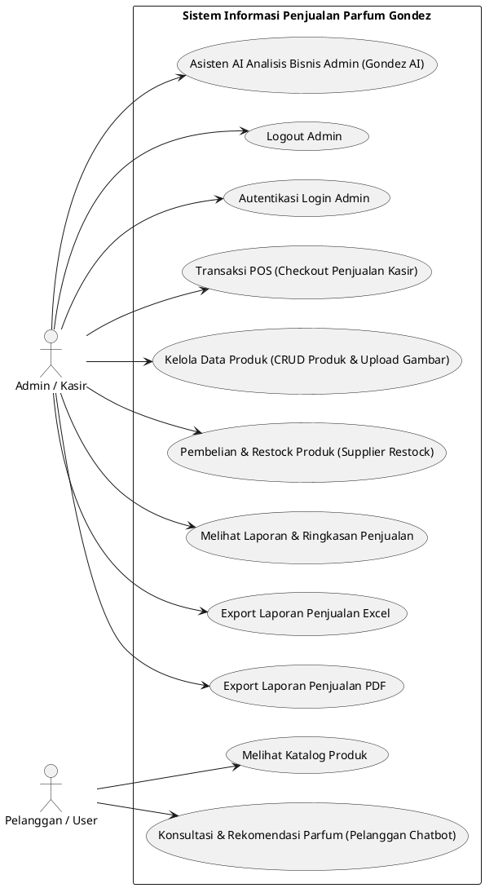
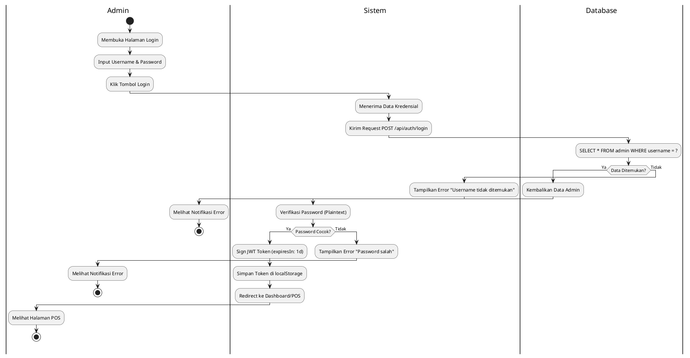
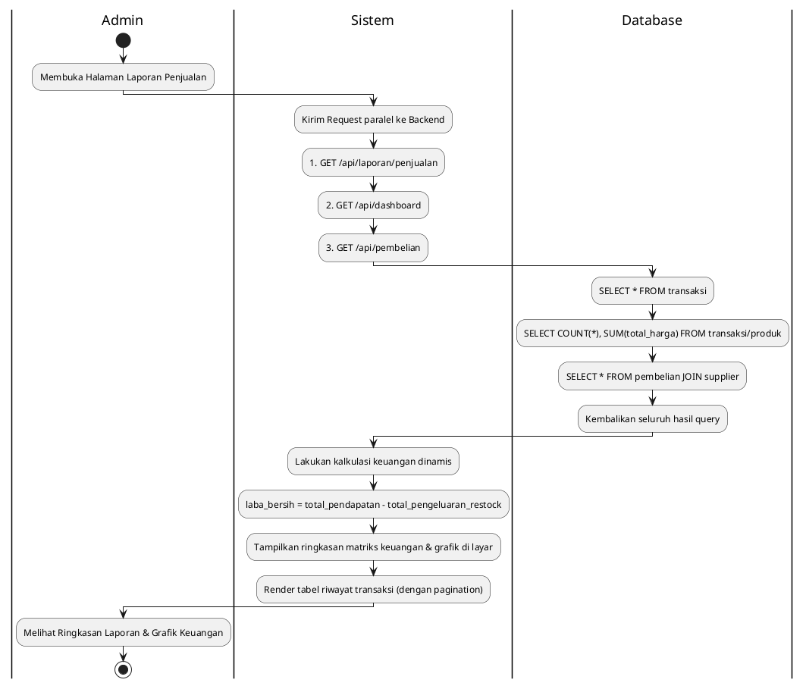
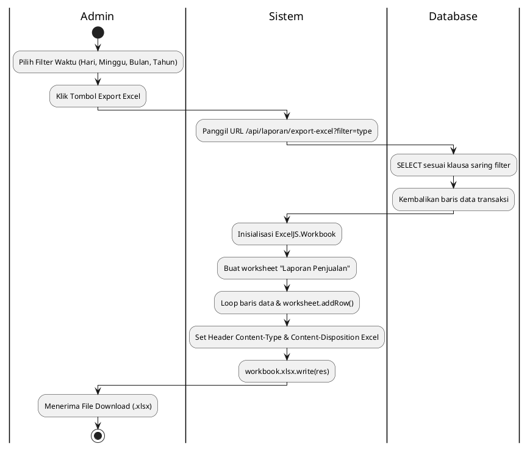
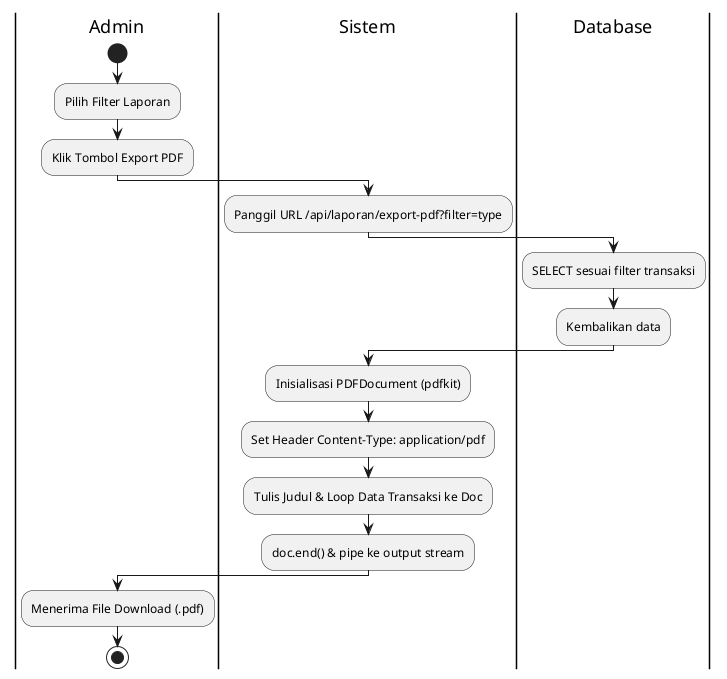
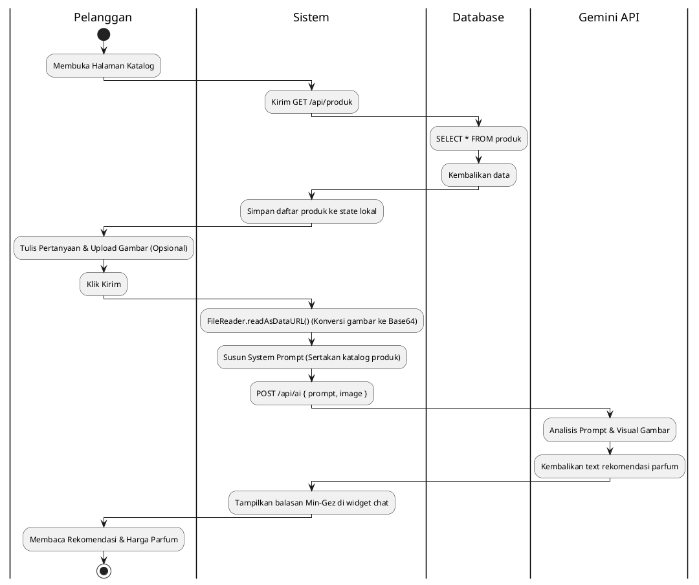
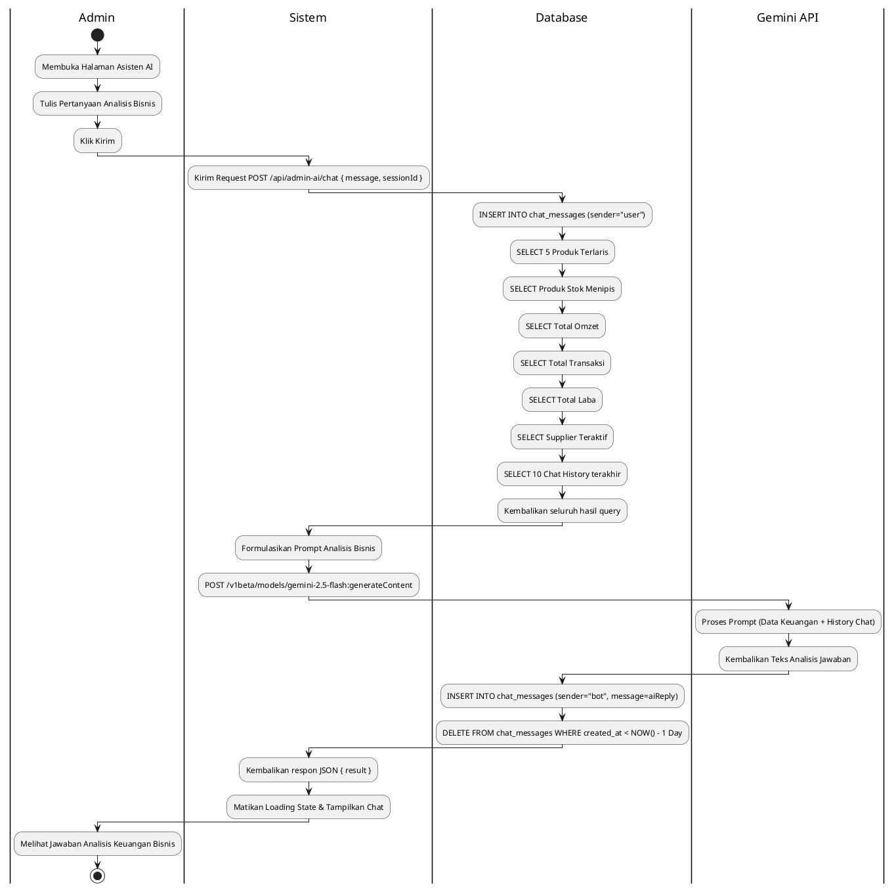
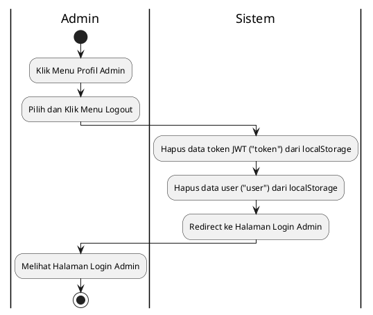

# Analisis UML & Perancangan Sistem Penjualan Gondez Parfum (BAB IV Skripsi)

Dokumen ini berisi analisis lengkap dan rancangan UML (Unified Modeling Language) berbasis kode program nyata dari aplikasi **Sistem Informasi Penjualan Parfum Gondez**. 

* **Activity Diagram, Use Case, Class, & ERD:** Menggunakan syntax **PlantUML** standar.
* **Sequence Diagram:** Menggunakan nama halaman website formal berbasis format **Mermaid.js**.

---

## I. Identifikasi Komponen & Aliran Data Sistem

### 1. Daftar Menu & Fitur Berdasarkan Sektor Pengguna
* **Sektor Pelanggan (Public View):**
  * **Katalog Produk:** Menampilkan nama parfum, kategori, sisa stok, deskripsi aroma, dan harga per ml.
  * **Konsultasi & Rekomendasi Parfum (Pelanggan Chatbot):** Chatbot melayang (floating widget) untuk konsultasi parfum, pencarian berdasarkan nama, dan pencarian visual menggunakan upload foto (Base64).
* **Sektor Admin (Protected View):**
  * **Autentikasi Login Admin:** Akses masuk admin terproteksi token JWT.
  * **Transaksi POS (Checkout Penjualan Kasir):** Cashier checkout untuk menginput keranjang, cek stok otomatis, input nominal bayar, metode bayar, nama customer, cetak invoice, dan kembalian.
  * **Kelola Data Produk (CRUD Produk & Upload Gambar):** Penambahan produk baru (+ upload gambar via Multer), edit varian, restock kilat, dan hapus.
  * **Pembelian & Restock Produk (Supplier Restock):** Formulir pencatatan pengeluaran restock dari Supplier ke database menggunakan database transaction.
  * **Melihat Laporan & Ringkasan Penjualan:** Dashboard laporan omset, laba bersih, rata-rata transaksi, kuantitas item terjual, pencarian tanggal, export PDF, dan export Excel.
  * **Export Laporan Penjualan Excel:** Tombol ekspor data transaksi penjualan terfilter ke dalam format Excel (.xlsx).
  * **Export Laporan Penjualan PDF:** Tombol ekspor data transaksi penjualan terfilter ke dalam format PDF (.pdf).
  * **Asisten AI Analisis Bisnis Admin (Gondez AI):** Halaman asisten analisis bisnis khusus admin untuk membaca ringkasan omset kotor, profit bersih, stok limit, dan performa supplier.
  * **Logout Admin:** Tombol keluar akun admin untuk menghapus token JWT dan data user dari localStorage serta redirect ke halaman login.

### 2. Pemetaan File & Relasi Data
* **Controller Backend:**
  * `authController.ts` -> `/api/auth/login` (Metode POST)
  * `produkController.ts` -> `/api/produk` (GET, POST, PUT, DELETE)
  * `transaksiController.ts` -> `/api/transaksi` (POST, GET)
  * `pembelianController.ts` -> `/api/pembelian` (POST, GET)
  * `laporanController.ts` -> `/api/laporan` (GET, export-excel, export-pdf)
  * `dashboardController.ts` -> `/api/dashboard` (GET)
  * `adminAIController.ts` -> `/api/admin-ai/chat` (POST)
  * `aiRoutes.ts` (inline) -> `/api/ai` (POST untuk chatbot publik)
* **Frontend Pages & Services:**
  * **Halaman POS Kasir** -> Memanggil endpoint `/api/transaksi` dan `/api/produk`.
  * **Halaman Kelola Produk** -> Memanggil endpoint `/api/produk` via FormData (Multer).
  * **Halaman Pembelian & Restock** -> Memanggil endpoint `/api/pembelian` dan `/api/supplier`.
  * **Halaman Laporan Penjualan** -> Memanggil `/api/laporan/penjualan` & `/api/dashboard` (via hook `useDashboard`).
  * **Halaman Asisten AI Admin** -> Memanggil `/api/admin-ai/chat`.
  * **Menu Profil Admin** -> Melakukan pembersihan data localStorage client-side untuk Logout.

---

## II. DIAGRAM UML

### A. Use Case Diagram (PlantUML)
Menggambarkan batasan sistem dan interaksi antara Aktor (Admin & Pelanggan) dengan use case yang tersedia di sistem.



---

### B. Activity Diagram UML (PlantUML)

#### 1. Autentikasi Login Admin


#### 2. Transaksi POS (Checkout Penjualan Kasir)
```plantuml
@startuml
|Admin|
start
:Pilih Produk Parfum;
:Input Volume (Qty ML);
:Input Nama Customer & Uang Bayar;
:Klik Tombol Checkout;

|Sistem|
:Validasi Uang Bayar >= Total Harga;
if (Uang Bayar Cukup?) then (Ya)
  :Kirim Request POST /api/transaksi;
  
  |Database|
  loop Untuk setiap item belanja
    :SELECT stok_ml FROM produk WHERE id = ?;
    |Sistem|
    :Validasi Kecukupan Stok;
  endloop
  
  if (Semua Stok Cukup?) then (Ya)
    |Database|
    :INSERT INTO transaksi (invoice, total_harga, ...);
    :Ambil transaksiId (insertId);
    loop Untuk setiap item belanja
      :INSERT INTO detail_transaksi (transaksi_id, produk_id, ...);
      :UPDATE produk SET stok_ml = stok_ml - qty_ml WHERE id = ?;
    endloop
    :Kirim status sukses & uang_kembalian;
    
    |Sistem|
    :Reset Keranjang Belanja;
    :Cetak Invoice di Layar;
    |Admin|
    :Menerima Struk Invoice & Uang Kembalian;
    stop
  else (Tidak)
    |Sistem|
    :Tampilkan Error "Stok tidak mencukupi untuk parfum X";
    |Admin|
    :Melihat Notifikasi Gagal;
    stop
  endif
else (Tidak)
  |Sistem|
  :Tampilkan Error "Uang yang dibayarkan kurang!";
  |Admin|
  :Melihat Notifikasi Gagal;
  stop
endif
@enduml
```

#### 3. Pembelian & Restock Produk (Supplier Restock)
```plantuml
@startuml
|Admin|
start
:Buka Halaman Pembelian;
:Pilih Supplier;
:Tambah Item Produk, Qty ML, & Harga Beli;
:Klik Simpan Pembelian;

|Sistem|
:Kirim Request POST /api/pembelian;

|Database|
:Mulai Koneksi Database Pool;
:connection.beginTransaction();
try
  :INSERT INTO pembelian (invoice_pembelian, supplier_id, ...);
  :Dapatkan pembelianId (insertId);
  loop Untuk setiap item pembelian
    :INSERT INTO detail_pembelian (pembelian_id, produk_id, ...);
    :UPDATE produk SET stok_ml = stok_ml + qty_ml WHERE id = ?;
  endloop
  :connection.commit() (Simpan Permanen);
  |Sistem|
  :Kirim Status Berhasil (200 OK);
  |Admin|
  :Melihat Status Berhasil & Riwayat Terupdate;
  stop
catch (Error)
  |Database|
  :connection.rollback() (Batalkan Seluruh Query);
  |Sistem|
  :Kirim Status Error (500);
  |Admin|
  :Melihat Notifikasi Gagal;
  stop
end try
@enduml
```

#### 4. Kelola Data Produk (CRUD Produk & Upload Gambar)
```plantuml
@startuml
|Admin|
start
:Membuka Halaman Kelola Produk;
alt Tambah Produk
  :Input Nama, Kategori, Deskripsi, Harga, Stok;
  :Pilih Foto Produk (Gambar);
  :Klik Simpan Produk;
  |Sistem|
  :Proses Upload Gambar via Multer;
  :Kirim Request POST /api/produk;
  |Database|
  :INSERT INTO produk (nama, kategori, ..., image);
  :Kembalikan status sukses;
else Edit Produk
  |Admin|
  :Ubah Atribut Produk (Nama/Kategori/Harga/Stok);
  :Klik Simpan Update;
  |Sistem|
  :Kirim Request PUT /api/produk/:id;
  |Database|
  :UPDATE produk SET nama = ?, kategori = ? ... WHERE id = ?;
  :Kembalikan status sukses;
else Hapus Produk
  |Admin|
  :Klik Tombol Hapus Produk;
  |Sistem|
  :Kirim Request DELETE /api/produk/:id;
  |Database|
  :DELETE FROM produk WHERE id = ?;
  :Kembalikan status sukses;
end alt
|Sistem|
:Refresh Daftar Produk di Layar;
|Admin|
:Melihat Perubahan Data Produk;
stop
@endluml
```

#### 5. Melihat Laporan & Ringkasan Penjualan


#### 6. Export Laporan Penjualan Excel


#### 7. Export Laporan Penjualan PDF


#### 8. Konsultasi & Rekomendasi Parfum (Pelanggan Chatbot)


#### 9. Asisten AI Analisis Bisnis Admin (Gondez AI)


#### 10. Logout Admin


---

### C. Sequence Diagram UML (Mermaid.js)

#### 1. Autentikasi Login Admin
```mermaid
sequenceDiagram
    autonumber
    actor Admin
    participant Front as Halaman Login Admin
    participant Ctrl as authController.login
    database DB as admin (MySQL)

    Admin->>Front: Input Username & Password & Klik Login
    activate Front
    Front->>Ctrl: POST /api/auth/login { username, password }
    activate Ctrl

    Ctrl->>DB: SELECT * FROM admin WHERE username = ?
    activate DB
    DB-->>Ctrl: Data Admin (Record)
    deactivate DB

    alt Username Tidak Ditemukan
        Ctrl-->>Front: 401 Unauthorized { message: "Username tidak ditemukan" }
        Front-->>Admin: Tampilkan error
    else Password Salah
        Ctrl-->>Front: 401 Unauthorized { message: "Password salah" }
        Front-->>Admin: Tampilkan error
    else Login Berhasil
        Ctrl->>Ctrl: jwt.sign(payload, "SECRET_KEY")
        Ctrl-->>Front: 200 OK { token, admin }
        deactivate Ctrl
        Front->>Front: localStorage.setItem("token", token)
        Front-->>Admin: Redirect ke Halaman POS Kasir
    end
    deactivate Front
```

#### 2. Transaksi POS (Checkout Penjualan Kasir)
```mermaid
sequenceDiagram
    autonumber
    actor Kasir
    participant Front as Halaman POS Kasir
    participant Ctrl as transaksiController.createTransaksi
    database DB as Database (MySQL)

    Kasir->>Front: Tambah produk, input uang bayar, klik Checkout
    activate Front
    Front->>Ctrl: POST /api/transaksi { items, total_harga, ... }
    activate Ctrl

    Note over Ctrl: Hitung kembalian:<br/>uang_kembalian = uang_bayar - total_harga
    alt Uang Bayar Kurang (uang_kembalian < 0)
        Ctrl-->>Front: 400 Bad Request { error: "Uang kurang!" }
        Front-->>Kasir: Tampilkan error uang kurang
    else Proses Database
        loop Validasi Stok
            Ctrl->>DB: SELECT stok_ml, nama FROM produk WHERE id = ?
            activate DB
            DB-->>Ctrl: Hasil stok & nama
            deactivate DB
            alt Stok Habis/Kurang
                Ctrl-->>Front: 400 Bad Request { error: "Stok tidak mencukupi" }
                Front-->>Kasir: Tampilkan error stok habis
            end
        end

        Ctrl->>DB: INSERT INTO transaksi (...)
        activate DB
        DB-->>Ctrl: Sukses (Return insertId)
        deactivate DB

        loop Simpan detail & Kurangi stok
            Ctrl->>DB: INSERT INTO detail_transaksi (...)
            activate DB
            DB-->>Ctrl: Sukses detail
            deactivate DB
            Ctrl->>DB: UPDATE produk SET stok_ml = stok_ml - qty_ml WHERE id = ?
            activate DB
            DB-->>Ctrl: Sukses update stok
            deactivate DB
        end

        Ctrl-->>Front: 200 OK { message: "Transaksi berhasil", invoice, uang_kembalian }
        deactivate Ctrl
        Front->>Front: Reset Cart State
        Front-->>Kasir: Tampilkan struk & nominal kembalian
    end
    deactivate Front
```

#### 3. Pembelian & Restock Produk (Supplier Restock)
```mermaid
sequenceDiagram
    autonumber
    actor Admin
    participant Front as Halaman Pembelian & Restock
    participant Ctrl as pembelianController.createPembelian
    database DB as Database (MySQL)

    Admin->>Front: Isi data restock & klik Simpan
    activate Front
    Front->>Ctrl: POST /api/pembelian { supplier_id, items, total_harga }
    activate Ctrl

    Ctrl->>DB: db.getConnection()
    activate DB
    Ctrl->>DB: connection.beginTransaction()

    Ctrl->>DB: INSERT INTO pembelian (...)
    DB-->>Ctrl: Sukses (pembelianId)

    loop Setiap item restock
        Ctrl->>DB: INSERT INTO detail_pembelian (...)
        DB-->>Ctrl: Sukses detail
        Ctrl->>DB: UPDATE produk SET stok_ml = stok_ml + qty_ml WHERE id = ?
        DB-->>Ctrl: Sukses update stok
    end

    alt Tanpa Error (Commit)
        Ctrl->>DB: connection.commit()
        Ctrl-->>Front: 200 OK { message: "Pembelian berhasil disimpan" }
    else Terjadi Error (Rollback)
        Ctrl->>DB: connection.rollback()
        Ctrl-->>Front: 500 Internal Server Error { error }
    end

    Ctrl->>DB: connection.release()
    deactivate DB
    deactivate Ctrl
    Front-->>Admin: Tampilkan status & refresh halaman riwayat
    deactivate Front
```

#### 4. Kelola Data Produk (CRUD Produk & Upload Gambar)
```mermaid
sequenceDiagram
    autonumber
    actor Admin
    participant Front as Halaman Kelola Produk
    participant Ctrl as produkController
    database DB as Database (MySQL)

    Admin->>Front: Tambah/Ubah/Hapus Produk
    activate Front

    alt Tambah Produk (Upload Gambar)
        Front->>Ctrl: POST /api/produk (FormData: nama, kategori, image)
        activate Ctrl
        Note over Ctrl: Multer menyimpan file ke /uploads
        Ctrl->>DB: INSERT INTO produk (...)
        activate DB
        DB-->>Ctrl: Sukses
        deactivate DB
        Ctrl-->>Front: 200 OK { message: "Produk berhasil ditambahkan" }
        deactivate Ctrl
    else Edit Produk
        Front->>Ctrl: PUT /api/produk/:id (...)
        activate Ctrl
        Ctrl->>DB: UPDATE produk SET ... WHERE id = ?
        activate DB
        DB-->>Ctrl: Sukses
        deactivate DB
        Ctrl-->>Front: 200 OK { message: "Produk berhasil diupdate" }
        deactivate Ctrl
    else Hapus Produk
        Front->>Ctrl: DELETE /api/produk/:id
        activate Ctrl
        Ctrl->>DB: DELETE FROM produk WHERE id = ?
        activate DB
        DB-->>Ctrl: Sukses
        deactivate DB
        Ctrl-->>Front: 200 OK { message: "Produk berhasil dihapus" }
        deactivate Ctrl
    end

    Front->>Front: Ambil ulang data produk (refresh list)
    Front-->>Admin: Tampilkan daftar produk terbaru
    deactivate Front
```

#### 5. Melihat Laporan & Ringkasan Penjualan
```mermaid
sequenceDiagram
    autonumber
    actor Admin
    participant Front as Halaman Laporan Penjualan
    participant LaporanCtrl as laporanController
    participant DashCtrl as dashboardController
    participant PembelianCtrl as pembelianController
    database DB as Database (MySQL)

    Admin->>Front: Membuka Halaman Laporan Penjualan
    activate Front

    Front->>LaporanCtrl: GET /api/laporan/penjualan
    activate LaporanCtrl
    LaporanCtrl->>DB: SELECT * FROM transaksi ORDER BY created_at DESC
    activate DB
    DB-->>LaporanCtrl: Daftar Transaksi
    deactivate DB
    LaporanCtrl-->>Front: JSON Daftar Transaksi
    deactivate LaporanCtrl

    Front->>DashCtrl: GET /api/dashboard
    activate DashCtrl
    DashCtrl->>DB: SELECT data dashboard
    activate DB
    DB-->>DashCtrl: Metrik Dashboard
    deactivate DB
    DashCtrl-->>Front: JSON Metrik Dashboard
    deactivate DashCtrl

    Front->>PembelianCtrl: GET /api/pembelian
    activate PembelianCtrl
    PembelianCtrl->>DB: SELECT data pembelian
    activate DB
    DB-->>PembelianCtrl: Riwayat Pengeluaran
    deactivate DB
    PembelianCtrl-->>Front: JSON Riwayat Pengeluaran
    deactivate PembelianCtrl

    Front->>Front: Hitung laba bersih (Pendapatan - Pengeluaran)
    Front->>Front: Render grafik & metrik kartu laporan
    Front-->>Admin: Tampilkan Dashboard Laporan
    deactivate Front
```

#### 6. Export Laporan Penjualan Excel
```mermaid
sequenceDiagram
    autonumber
    actor Admin
    participant Front as Halaman Laporan Penjualan
    participant Ctrl as laporanController.exportExcel
    database DB as transaksi (MySQL)

    Admin->>Front: Klik "Export Excel"
    activate Front
    Front->>Ctrl: GET /api/laporan/export-excel?filter=filterType
    activate Ctrl

    Ctrl->>DB: SELECT * FROM transaksi WHERE filter ORDER BY created_at DESC
    activate DB
    DB-->>Ctrl: Baris data transaksi
    deactivate DB

    Note over Ctrl: Inisialisasi exceljs Workbook & Worksheet<br/>dan tambahkan baris data
    Ctrl-->>Front: File download stream (.xlsx)
    deactivate Ctrl
    Front-->>Admin: File otomatis terunduh di browser
    deactivate Front
```

#### 7. Export Laporan Penjualan PDF
```mermaid
sequenceDiagram
    autonumber
    actor Admin
    participant Front as Halaman Laporan Penjualan
    participant Ctrl as laporanController.exportPDF
    database DB as transaksi (MySQL)

    Admin->>Front: Klik "Export PDF"
    activate Front
    Front->>Ctrl: GET /api/laporan/export-pdf?filter=filterType
    activate Ctrl

    Ctrl->>DB: SELECT invoice, nama_customer, total_harga FROM transaksi
    activate DB
    DB-->>Ctrl: Data transaksi
    deactivate DB

    Note over Ctrl: Inisialisasi pdfkit Document<br/>dan loop write data ke doc
    Ctrl-->>Front: File PDF Stream (application/pdf)
    deactivate Ctrl
    Front-->>Admin: Unduh file PDF
    deactivate Front
```

#### 8. Konsultasi & Rekomendasi Parfum (Pelanggan Chatbot)
```mermaid
sequenceDiagram
    autonumber
    actor Pelanggan
    participant Front as Halaman Katalog & Chatbot Pelanggan
    participant Ctrl as aiRoutes (/api/ai)
    participant AI as Gemini 2.5 Flash API
    database DB as produk (MySQL)

    Pelanggan->>Front: Buka katalog (muat awal list produk)
    activate Front
    Front->>DB: SELECT * FROM produk
    activate DB
    DB-->>Front: Data varian parfum
    deactivate DB
    Front->>Front: Set list produk ke state

    Pelanggan->>Front: Input pesan & foto parfum, klik Kirim
    Front->>Front: FileReader.readAsDataURL() (Base64)
    Front->>Front: Susun System Prompt (Sertakan katalog produk)
    Front->>Ctrl: POST /api/ai { prompt: systemPrompt, image: base64Image }
    activate Ctrl

    Ctrl->>AI: POST /generateContent?key=GEMINI_API_KEY
    activate AI
    AI-->>Ctrl: JSON response (Rekomendasi Parfum)
    deactivate AI

    Ctrl-->>Front: 200 OK { result: botReply }
    deactivate Ctrl
    Front-->>Pelanggan: Tampilkan teks rekomendasi di chat log
    deactivate Front
```

#### 9. Asisten AI Analisis Bisnis Admin (Gondez AI)
```mermaid
sequenceDiagram
    autonumber
    actor Admin
    participant Front as Halaman Asisten AI Admin
    participant Ctrl as adminAIController.adminAIChat
    participant AI as Gemini 2.5 Flash API
    database DB as Database (MySQL)

    Admin->>Front: Tulis pertanyaan bisnis & klik Kirim
    activate Front
    Front->>Ctrl: POST /api/admin-ai/chat { message, sessionId }
    activate Ctrl

    Ctrl->>DB: INSERT INTO chat_messages (sender="user")
    activate DB
    DB-->>Ctrl: Sukses
    deactivate DB

    rect rgba(0, 0, 255, 0.05)
        Note over Ctrl, DB: Proses Agregasi Statistik Bisnis
        Ctrl->>DB: SELECT 5 Produk Terlaris
        DB-->>Ctrl: Data best selling
        Ctrl->>DB: SELECT Produk Stok Menipis
        DB-->>Ctrl: Data low stock
        Ctrl->>DB: SELECT total omzet
        DB-->>Ctrl: Total sales
        Ctrl->>DB: SELECT total transaksi
        DB-->>Ctrl: Total trx
        Ctrl->>DB: SELECT total laba
        DB-->>Ctrl: Total profit
        Ctrl->>DB: SELECT 5 Supplier Teraktif
        DB-->>Ctrl: Top suppliers
    end

    Ctrl->>DB: SELECT sender, message FROM chat_messages LIMIT 10
    activate DB
    DB-->>Ctrl: Chat history
    deactivate DB

    Note over Ctrl: Gabungkan Data Bisnis, History & Pertanyaan ke Prompt
    Ctrl->>AI: POST /generateContent?key=GEMINI_API_KEY { Prompt }
    activate AI
    AI-->>Ctrl: Teks jawaban analisis bisnis
    deactivate AI

    Ctrl->>DB: INSERT INTO chat_messages (sender="bot", message=aiReply)
    activate DB
    DB-->>Ctrl: Sukses
    deactivate DB

    Ctrl-->>Front: 200 OK { result: aiReply }
    deactivate Ctrl

    Ctrl->>DB: DELETE FROM chat_messages WHERE created_at < NOW() - 1 Hari
    activate DB
    DB-->>Ctrl: Sukses pembersihan
    deactivate DB

    Front-->>Admin: Tampilkan jawaban analisis bisnis
    deactivate Front
```

#### 10. Logout Admin
```mermaid
sequenceDiagram
    autonumber
    actor Admin
    participant Front as Menu Profil Admin

    Admin->>Front: Klik Tombol "Logout"
    activate Front
    Front->>Front: localStorage.removeItem("token")
    Front->>Front: localStorage.removeItem("user")
    Front->>Front: navigate("/login-admin")
    Front-->>Admin: Tampilkan Halaman Login Admin (Redirect)
    deactivate Front
```

---

### D. Class Diagram UML (PlantUML)
```plantuml
@startuml
skinparam classAttributeIconSize 0

package "Frontend Models (Types)" {
  interface Produk {
    +id: number
    +nama: string
    +kategori: string
    +deskripsi: string
    +harga_per_ml: number
    +stok_ml: number
    +image: string
    +created_at: string
  }
  
  interface Transaksi {
    +id: number
    +invoice: string
    +total_harga: number
    +total_item: number
    +metode_pembayaran: string
    +nama_customer: string
    +uang_bayar: number
    +uang_kembalian: number
    +created_at: string
    +items: DetailItem[]
  }
}

package "Backend Controllers" {
  class AuthController {
    +login(req: Request, res: Response): Promise
  }

  class ProdukController {
    +getProduk(req: Request, res: Response): Promise
    +getProdukById(req: Request, res: Response): Promise
    +createProduk(req: Request, res: Response): Promise
    +updateProduk(req: Request, res: Response): Promise
    +restockProduk(req: Request, res: Response): Promise
    +deleteProduk(req: Request, res: Response): Promise
  }

  class TransaksiController {
    +createTransaksi(req: Request, res: Response): Promise
    +getTransaksi(req: Request, res: Response): Promise
    +getStatistikPenjualan(req: Request, res: Response): Promise
  }

  class PembelianController {
    +createPembelian(req: Request, res: Response): Promise
    +getPembelian(req: Request, res: Response): Promise
    +getPembelianById(req: Request, res: Response): Promise
  }

  class LaporanController {
    +getLaporanPenjualan(req: Request, res: Response): Promise
    +getLaporanLabaRugi(req: Request, res: Response): Promise
    +exportExcel(req: Request, res: Response): Promise
    +exportPDF(req: Request, res: Response): Promise
    -dapatkanKueriFilterWaktu(filterType: string): string
  }

  class AdminAIController {
    +adminAIChat(req: Request, res: Response): Promise
  }

  class DashboardController {
    +getDashboardData(req: Request, res: Response): Promise
  }
}

class DatabasePool {
  +db.query(sql: string, params: array): Promise
  +db.getConnection(): Promise
}

ProdukController --> DatabasePool : use
TransaksiController --> DatabasePool : use
PembelianController --> DatabasePool : use
LaporanController --> DatabasePool : use
AdminAIController --> DatabasePool : use
AuthController --> DatabasePool : use
DashboardController --> DatabasePool : use
@enduml
```

---

### E. Entity Relationship Diagram (PlantUML)
```plantuml
@startuml
skinparam linetype ortho

entity "admin" as admin {
  *id : INT (PK, AutoIncrement)
  --
  username : VARCHAR(255)
  password : VARCHAR(255)
}

entity "produk" as produk {
  *id : INT (PK, AutoIncrement)
  --
  nama : VARCHAR(255)
  kategori : VARCHAR(255)
  deskripsi : TEXT
  harga_per_ml : DECIMAL(10,2)
  harga_beli_per_ml : DECIMAL(10,2)
  stok_ml : INT
  image : VARCHAR(255)
  created_at : TIMESTAMP
}

entity "supplier" as supplier {
  *id : INT (PK, AutoIncrement)
  --
  nama_supplier : VARCHAR(255)
  no_telp : VARCHAR(50)
  alamat : TEXT
}

entity "pembelian" as pembelian {
  *id : INT (PK, AutoIncrement)
  --
  invoice_pembelian : VARCHAR(100)
  supplier_id : INT (FK)
  total_harga : DECIMAL(15,2)
  created_at : TIMESTAMP
}

entity "detail_pembelian" as detail_pembelian {
  *id : INT (PK, AutoIncrement)
  --
  pembelian_id : INT (FK)
  produk_id : INT (FK)
  qty_ml : INT
  harga_beli_per_ml : DECIMAL(10,2)
  subtotal : DECIMAL(15,2)
}

entity "transaksi" as transaksi {
  *id : INT (PK, AutoIncrement)
  --
  invoice : VARCHAR(100)
  total_harga : DECIMAL(15,2)
  total_item : INT
  metode_pembayaran : VARCHAR(50)
  nama_customer : VARCHAR(255)
  uang_bayar : DECIMAL(15,2)
  uang_kembalian : DECIMAL(15,2)
  created_at : TIMESTAMP
}

entity "detail_transaksi" as detail_transaksi {
  *id : INT (PK, AutoIncrement)
  --
  transaksi_id : INT (FK)
  produk_id : INT (FK)
  nama_produk : VARCHAR(255)
  qty_ml : INT
  harga_per_ml : DECIMAL(10,2)
  subtotal : DECIMAL(15,2)
}

entity "chat_messages" as chat_messages {
  *id : INT (PK, AutoIncrement)
  --
  session_id : VARCHAR(100)
  sender : VARCHAR(50)
  message : TEXT
  created_at : TIMESTAMP
}

supplier ||--o{ pembelian : "supplies"
pembelian ||--|{ detail_pembelian : "contains"
produk ||--o{ detail_pembelian : "restocked"
transaksi ||--|{ detail_transaksi : "contains"
produk ||--o{ detail_transaksi : "sold"
@enduml
```
